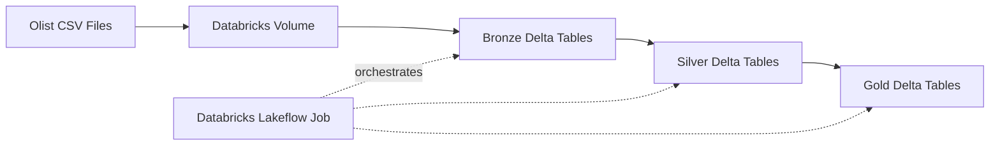

# Olist Data Engineering Project

## Project Overview
This project was created as a hands-on learning project focused on data engineering in Databricks.

It enabled me to practise:
- PySpark
- Medallion Architecture
- Configuring and running Databricks Jobs

The project uses the [Olist Brazilian E-Commerce dataset](https://www.kaggle.com/datasets/olistbr/brazilian-ecommerce).

Raw CSV files are stored in a Databricks Volume and processed through Bronze, Silver and Gold layers.

## Architecture

The pipeline follows the Medallion Architecture and is orchestrated using a Databricks Lakeflow Job.

## Tech Stack
- Databricks
- PySpark
- Delta Lake
- Unity Catalog
- Lakeflow Jobs
- Git / GitHub
  
## Data Pipeline

### Bronze

Raw CSV files are read from a Databricks Volume. Their schemas and row counts are reviewed before the data is written to Bronze Delta tables. The written tables are validated against the source files.

### Silver

Bronze tables are loaded and checked for schema consistency, null values and duplicate business keys.

The Silver layer includes data enrichment and business transformations:
- customer city and state are added to orders,
- `is_late` is added to identify late orders,
- `delivery_delay_days` is calculated,
- missing product metadata is kept unchanged after investigation.

The transformed data is saved as Silver Delta tables and validated after writing.

### Gold

The Gold layer contains three business-oriented aggregations:
- sales per month,
- delivery performance by customer state,
- revenue by product category.

### Gold Layer Outputs

The following visualizations present selected outputs from the Gold layer.

#### Monthly Sales

Monthly revenue for delivered orders:

#### Delivery Performance by State

Percentage of late deliveries by customer state:

#### Product Category Performance

Top 10 product categories by revenue:

## Orchestration

A Databricks Lakeflow Job orchestrates the complete pipeline:

Bronze → Silver → Gold

Task dependencies ensure that each layer runs only after the previous layer has completed successfully.

## Data Quality and Key Decisions

- Row counts and schemas were reviewed.
- Null values were checked across all datasets.
- Missing delivery timestamps in `orders` are mostly consistent with order status.
- 8 delivered orders have no delivery timestamp and are kept unchanged.
- Missing product metadata was not filtered out because the affected products are associated with real sales.
- No duplicate business keys were found:
  - `orders`: `order_id`
  - `customers`: `customer_id`
  - `products`: `product_id`
  - `order_items`: (`order_id`, `order_item_id`)
- Duplicate `customer_unique_id` values are expected because one customer can place multiple orders.
- The same customer may have different location records across orders.

### Business Rules
`Orders`
- Missing delivery timestamps are kept unchanged.
- Missing delivery dates are not imputed.
- Undelivered orders are handled explicitly when calculating delivery metrics.

`Products`
- Missing product metadata is preserved in the Silver layer.
- Missing product categories are represented as `unknown` in the Gold reporting layer.
  
## Future Improvements

## What I learned
