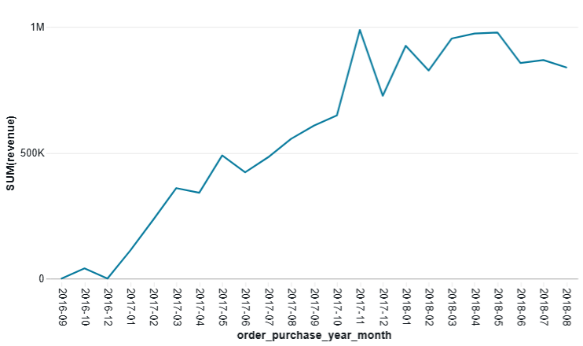
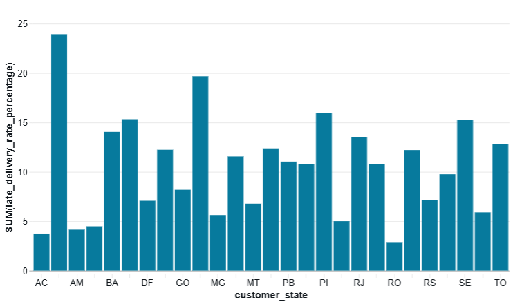
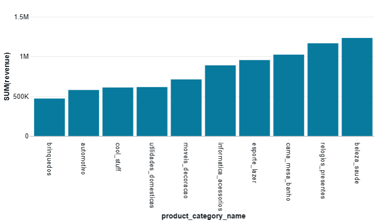

# Olist Data Engineering Project

## Project Overview
This project was created as a hands-on learning project focused on Data Engineering in Databricks.

It enabled me to practise:
- Pyspark
- Medallion Architecture
- Configuring and running Databricks Jobs

The project uses the [Olist Brazilian E-Commerce dataset](https://www.kaggle.com/datasets/olistbr/brazilian-ecommerce).

Raw CSV files are stored in a Databricks Volume and processed through Bronze, Silver and Gold layers.

## Architecture
Raw CSV files
↓
Bronze
↓
Silver
↓
Gold

The three layers are orchestrated using a Databricks Lakeflow Job.

## Tech Stack
- Databricks
- PySpark
- Delta Lake
- Unity Catalog
- Lakeflow Jobs
- Git / GitHub
  
## Data Pipeline

### Bronze

Raw CSV files are read from a Databricks Volume. Their schemas and row counts are reviewed before the data is written to Bronze Delta tables. The written tables are validated against the source files.

### Silver

Bronze tables are loaded and checked for schema consistency, null values adn duplicate business keys.

The Silver layer includes data enrichment and business transformations:
- customer city and state are added to orders,
- `is_late` is added to idenfiy late orders,
- `delivery_delay_days` is calculated,
- missing product metadata is unchaned after investigation.

The transformed data is saved as Silver Delta tables and validated after writing.

### Gold

A Databricks Lakeflow Job orchistrates the complete pipeline:

Bronze → Silver → Gold

Task dependencies make sure that each layer runs only after the previous layer was completed successfully.

### Gold Layer Outputs

The Gold layer provides business-oriented aggregations that can be used for reporting and analysis.

#### Monthly Sales

Monthly revenue for delivered orders:

#### Delivery Performance by State

Percentage of late deliveries by customer state:

#### Product Category Performance

Top 10 product categories by revenue:

## Data Quality and Key Decisions

- Row counts and schemas were reviewed.
- Null values were checked across all datasets.
- Missing delivery timestamps in `orders` are mostly consistent with order status.
- 8 delivered orders have no delivery timestamp and are kept unchanged for now.
- `products` contains missing product metadata that will be handled intentionally in the cleaning step.
- No duplicate business keys were found:
  - `orders`: `order_id`
  - `customers`: `customer_id`
  - `products`: `product_id`
  - `order_items`: (`order_id`, `order_item_id`)
- Duplicate `customer_unique_id` values are expected because one customer can place multiple orders.
- The same customer may have different location records across orders.

### Business rules
`Orders`
- Keep missing delivery timestamps unchanged.
- Do not fill in missing delivery dates.
- Handle undelivered orders explicitly when creating delivery metrics

`Products`
- Investigate missing product metadata.
- Decide whether missing values require cleaning or should remain null.
- 
## Future Improvements

## What I learned
